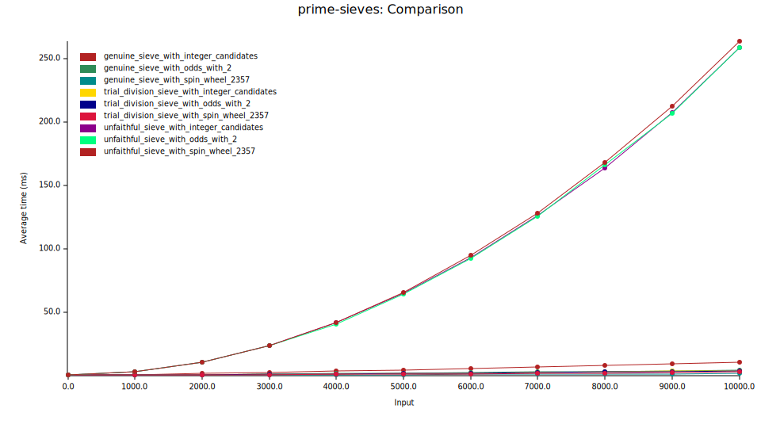

<p align="center">
<h1 align="center"><code>lazy-prime-sieve</code></h1>
</p>

<p align="center">
  <a href="https://github.com/arindas/lazy-prime-sieve/actions/workflows/rust-ci.yml">
    
  </a>
  <a href="https://codecov.io/gh/arindas/lazy-prime-sieve">
    
  </a>
</p>

<p align="center">
Lazy Sieve of Eratosthenes for infinitely generating primes lazily in Rust.
</p>

## Usage

`lazy-prime-sieve` is a library crate. You may add it to your `Cargo.toml` as
follows:

```toml
[dependencies]
lazy-prime-sieve = "0.1.0"
```

`lazy-prime-sieve` provides iterators for infinitely generating primes. This
crate provides a convenience method `::primes()` which returns the most
efficient iterator (in this crate) for generating primes.


```rust
use lazy_prime_sieve::primes;

for i in primes().take(10) {
    println!("{i}");
}
```

## Benchmarks



This benchmark shows the time taken by the different prime generating iterators
in this crate to generate a certain number of primes. The `x-axis` shows the
number of primes generated, while the `y-axis` shows the amount of time taken.

## References

This crate heavily draws from the paper [The Genuine Sieve of
Eratosthenes](https://www.cs.hmc.edu/~oneill/papers/Sieve-JFP.pdf). This
repository attempts to provide non-recursive lazy Rust iterator based
alternatives to the proposed Haskell lazy recursion based approaches proposed
in the paper.

## License

`lazy-prime-sieve` is licensed under the MIT License. See
[License](https://raw.githubusercontent.com/arindas/lazy-prime-sieve/main/LICENSE)
for more details.
